

  <h1 style="font-size: larger;">
    
    <strong>STARK Easy</strong> 
    
  </h1>

</a>

## Stark Easy
In this document, we will explore the creation of Stark Easy, focusing on its principles and vision. Our goal is to establish a comprehensive library that covers a lot of content and resources about Starknet and its tech. We want to create an interactive environment that facilitates learning for new developers in this ecosystem, providing an accessible and enjoyable experience. Additionally, Stark Easy aims to enhance the knowledge of those who are taking their first steps or wish to expand their expertise.

Please note that this application is an experimental version still in Alpha, so proceed with caution.

This project is structured into three fundamental sections:

- **Stark Jitsu**: Here, you will find a compilation of learning resources, workshops, documents, and study spaces.

- **Stark Adobencha**: This is an educational entertainment section where you can have fun while learning about various topics, similar to those covered in Stark Jitsu.

- **Stark Dev-Station**: This section offers a variety of resources for both users and developers. You can explore aspects related to Cairo, deploy contracts, and discover the potential of Starknet first hand.  

## Stark Jitsu

In Stark Jitsu, you will have access to:

#### Hds:
A space that simulates the experience of HDS (Talking about Starknet), where each guest shares their knowledge about specific topics in the ecosystem. We are migrating this space with POAP here, where each secret word will unlock the corresponding button to create each `NHT` token. The idea is to migrate the ERC-721 contracts from Cairo 0 to Cairo contracts, where each word can be hidden in their own contract.

In this section, we can learn about the ecosystem with Spanish-speaking guests. We can claim our `NHT` using the secret word from the space, and these `NHT` can be viewed in `Braavos`, `Explorers`... 

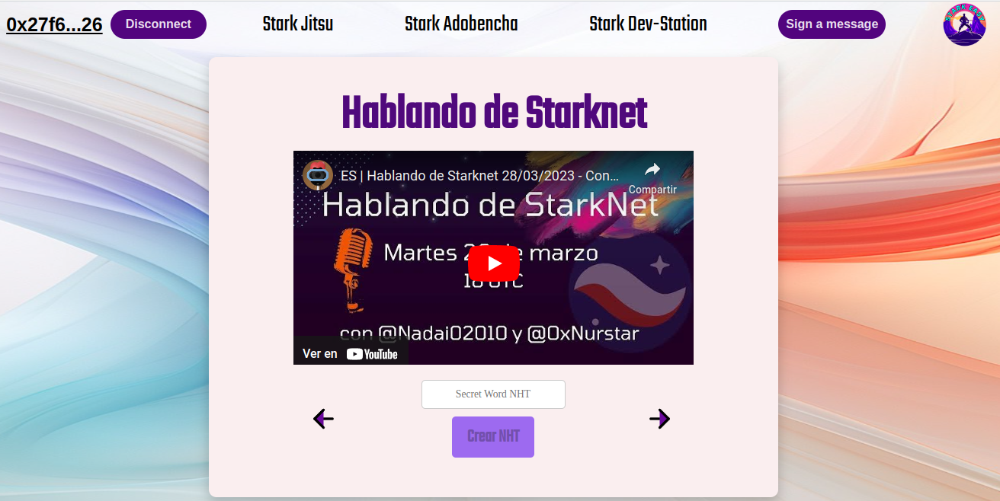

#### StarknetEs:
This tab is dedicated to Cairo Thursdays, which we organize for the Spanish-speaking community. Official resources such as Cairo Book, Starknet Book, Cairo Lang Docs, Starknet Docs, will also be added here.  

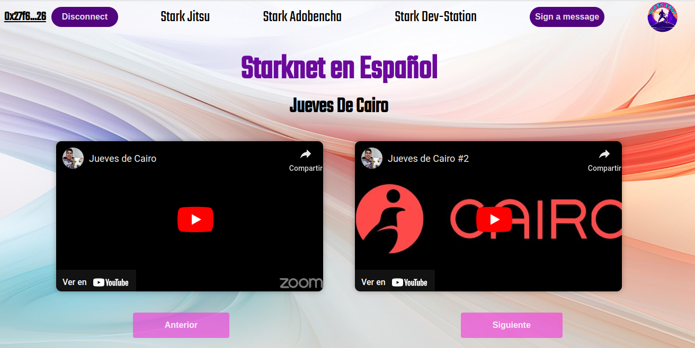
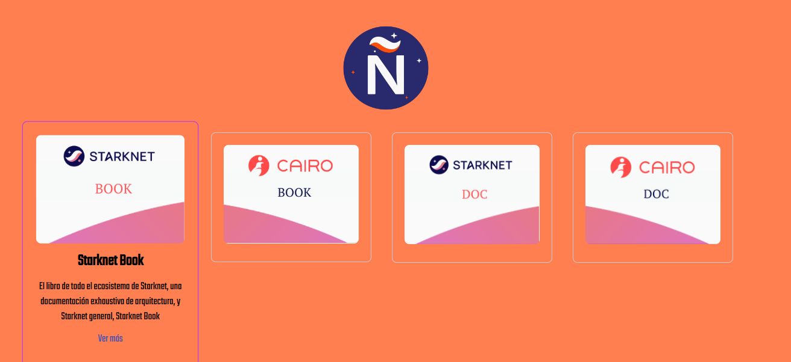

#### Workshop:
This tab is dedicated to the Pioneers Basecamp, the first decentralized Spanish-speaking basecamp powered by Starkware and carried out by some members of the community. You can also find a series of 7 workshops conducted by L2 in Spanish, featuring Omar Espejel and StarknetEs.  

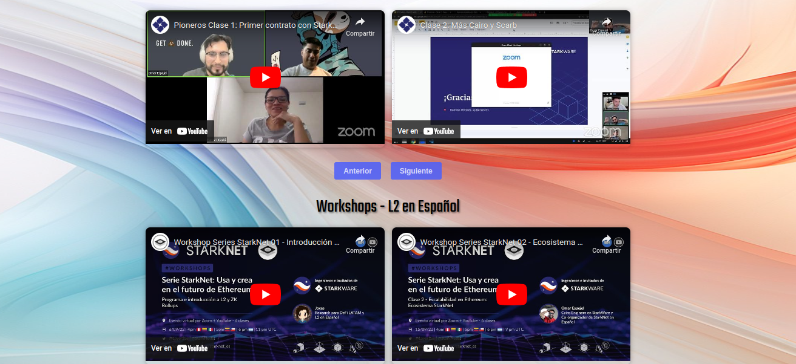

## Stark Adobencha
In this section of StarkEasy, you will be able to play educational mini-games that are part of a special Starknet adventure, where you will feel like a martial arts apprentice ready to embark on a journey to earn your Starknet belts while defeating dangerous enemies along the way. Creative characters and landscapes will enhance your gaming experience as you strive to achieve a high position on the Leaderboard.  

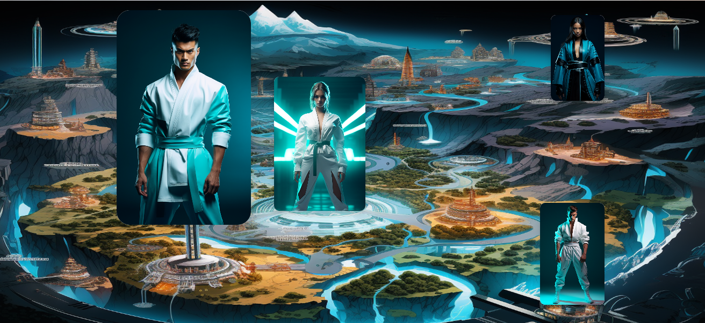

You'll have the choice between two languages, each with exclusive content that you can explore and overcome various challenges with different levels of questions and materials from your favorite Sensei. This section is still under construction in the Alpha phase.   

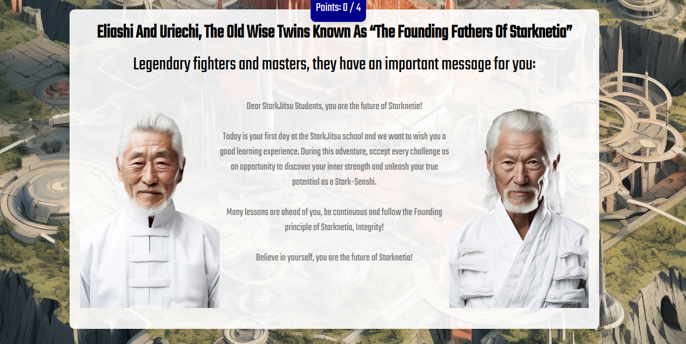

## Stark Dev-Station
Immerse yourself in the available resources in Stark Dev-Station:

#### Token Form:
A form that detects the balance of added tokens. A test token called `NAI` has been deployed on Cairo 1 (which allows for free minting of tokens), as well as tokens like `ETH`, `DAI`, `WBTC`, or `USDT`. In the form, you need to add the `Recipient`, the `Amount`, and a secret word `Nadai` to unlock the Send button.

In this section, we aim to showcase the power of customizing ERC-20 token transfers. We can view transaction data (`Calldata`) and demonstrate how it is executed in the explorer. 

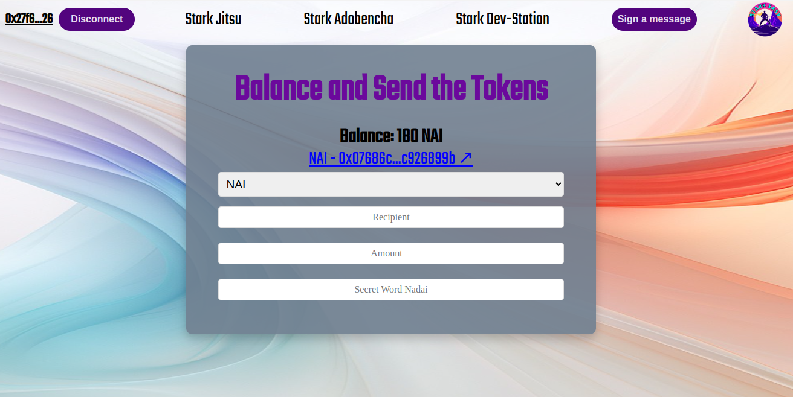

#### NHT: 
A gallery showcasing the designs of each ERC-721 token released, loading the metadata of each space. You can also send a token by indicating the values of  `From`, `Recipient` and `Token ID` along with the secret word to unlock the `Nadai` button.

In this section, we reinforce what we've learned in the token form. This time, we will see how the design is displayed in the transaction, the transaction data (`Calldata`), and how to move our POAP in a straightforward manner.  

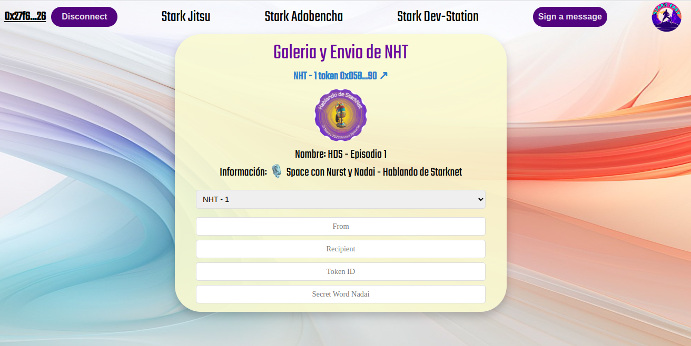

#### Terminal:
This tab is designed to learn the syntax of Cairo. The idea is to gradually add the new syntax and have a simulation of the result printed in the Terminal by executing the corresponding command.

In this section, you can enhance your learning with basic examples extracted from Cairo-by-Example, Cairo-Book, Starknet-Book, or other libraries and resources. The goal is to be able to directly read the code or contracts and test them without simulation, which would facilitate learning the syntax through clear examples.  

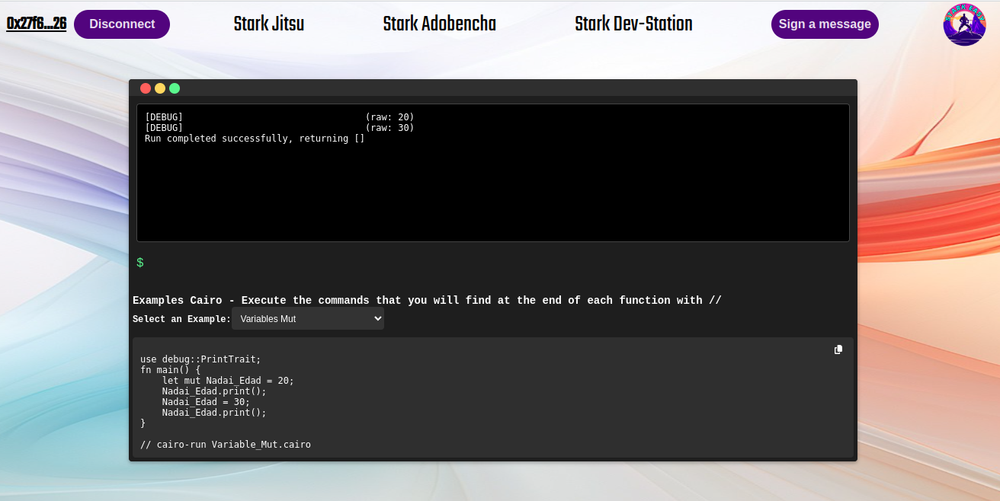

#### Standard:
This tab is designed as a standard for easily developable contracts. You can find information about each required data, as well as the contract logic in case you need it for other developments or training. Here, we will display the Class Hash of the declared contract and the number of arguments required for its deployment.

In addition, you will find an example of the arguments passed in each one in case you decide to deploy a standard contract. You can then proceed directly to the next section, Universal.  

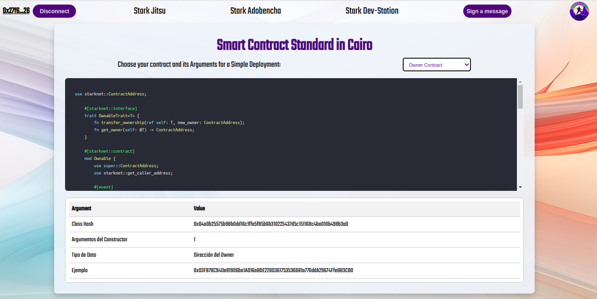

#### Universal:
This tab is designed to deploy contracts with just one click, using the Universal Deploy Contract  ([UDC](https://testnet.starkscan.co/contract/0x041a78e741e5af2fec34b695679bc6891742439f7afb8484ecd7766661ad02bf#write-contract)),deployment, making it easy, convenient, and secure for anyone looking to start testing in a straightforward way. You just need to decide what type of contract you need and adjust its values according to your requirements.

Additionally, we will provide the necessary steps to convert the values to felt252, along with an explanation and utility of each one.  

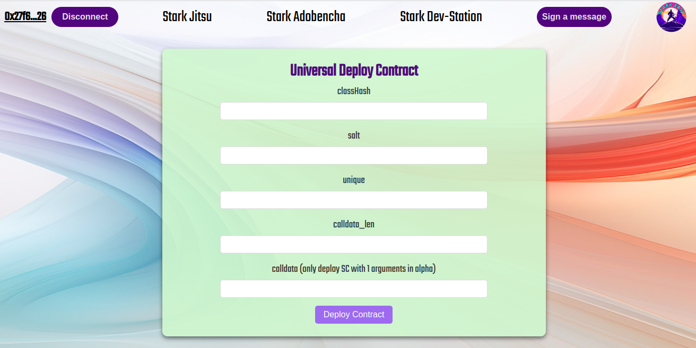

#### Multicall:
This tab will serve to learn about the power of native Multicall in Cairo. In this form, you can `Mint` the `NAI` token and `transfer` both `NAI` and `ETH` if desired, executing 3 different calls, each with its own set of data (`Calldata`).

In this section, we can demonstrate how infinite approvals are no longer needed and how DeFi protocols on Starknet benefit from this power. The idea is to add multiple Multicall forms, including one for UDC, and use the necessary parameters for each deployment, providing an easy way for developers to deploy ERC-20, ENS, ERC-1155, AMM, Vault, or any other smart contract in Cairo that we wish to add.  

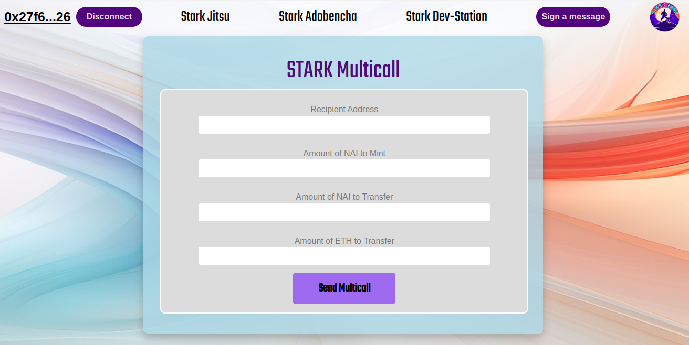

#### Multicall x100:
In this tab, you will be able to perform a multicall where you can mint the selected amount 100 times, all in one transaction but with 100 individual calls in a transaction. 

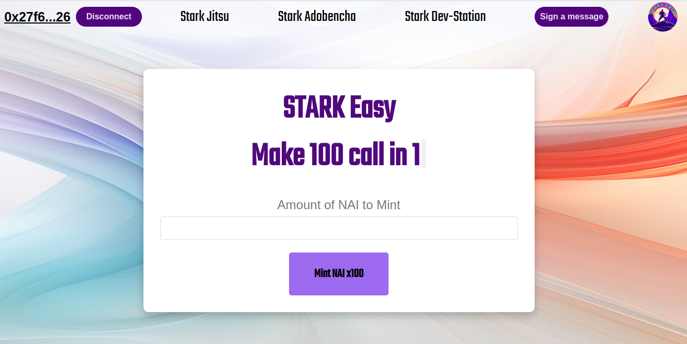

#### STARK Easy - ENS:
In this section, we have a felt converter that will be very useful if you want to use the STARK Easy ENS contract. With this contract, you can register your name associated with the wallet you are connected to, to have a record of your name for various purposes. In this hypothetical case, it could even be used to determine workshop attendance based on the minting time of the POAP.  

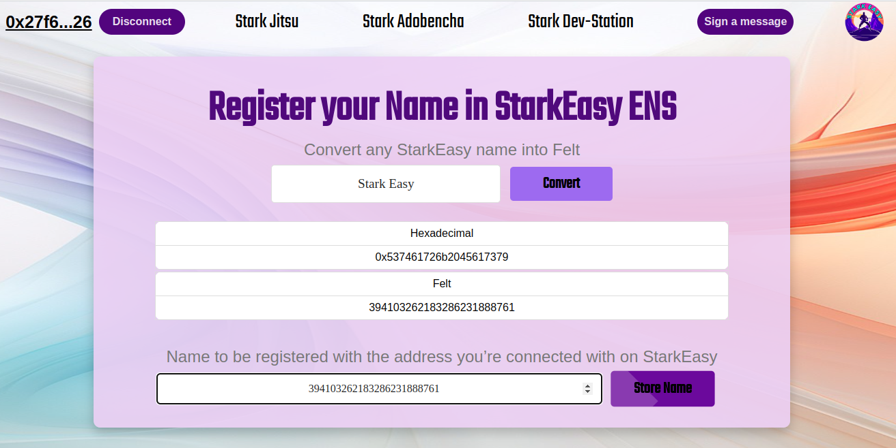

## Development and Acknowledgements
In this section, we would like to acknowledge those who have contributed directly or indirectly to the development and conception of Stark Easy.

- **Frontend Home**: 0xBeja and the KeepStrange team for creating the Madara and Tsubasa pages, adapted for our platform.

- **StarknetEs**: Starknet en Español for their extensive content on Starknet in Spanish and the L2 workshop in Spanish with Omar.

- **Starkware**: Starkware for Pioneros, a decentralized basecamp, and for allowing us to present this material in Spanish.

- **HDS**: The founders of Stark Easy for providing this space as an incubation center for new content and contributions.

- **Terminal**: The utility of the standard Cairo and Starknet example provided by Cairo by Example and Starknet by Example, by Nethermind and LambdaClass respectively.

- **Contrato de Owner**:The Starknet Book contract created by David Barreto, a standard in the dApp.

- **Argent**:  Adapted contracts from Min-Starknet, fundamental for our educational dApp, such as ENS.

- **Converter**:  Adapted from Stark Util with the assistance of Chat Gpt.

- **Starknet**: The UDC contract to implement universal deployments.

- **Personajes**: Midjourney for creating our custom fighters.

- **Otros colaboradores**: To all the people who have contributed with ideas and development, from Starknet.js to SHARP, PoaP graphic designers, content creators, and more. We also welcome new contributors.

With these acknowledgements, we highlight the effort that has made our vision a reality. We look forward to continuing to grow alongside our community.  

