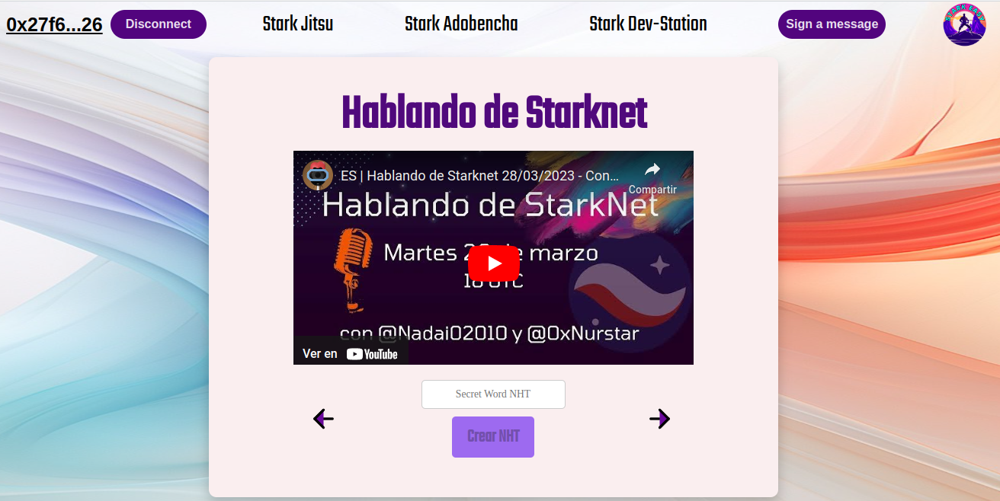
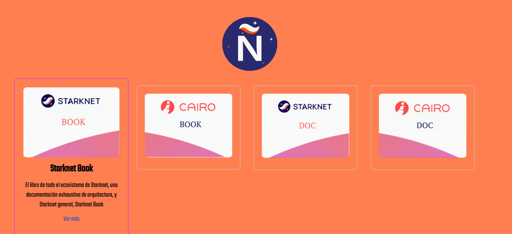
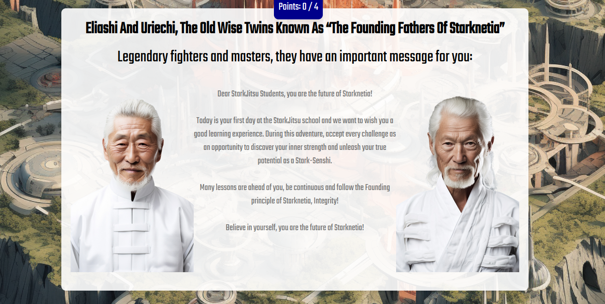
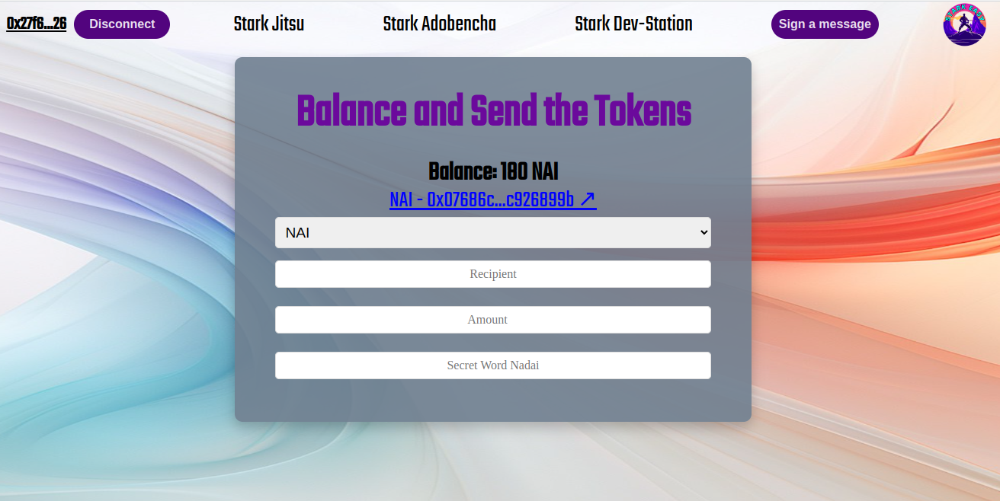
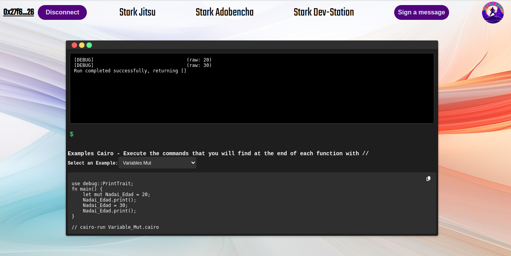
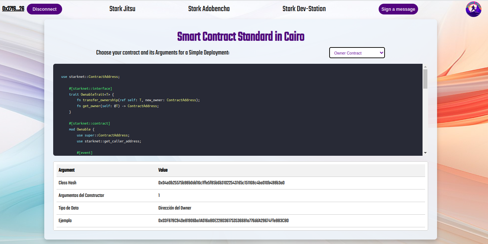

  <h1 style="font-size: larger;">
    
    <strong>STARK Easy</strong> 
    
  </h1>

</a>

## Stark Easy
En este documento, exploraremos la creación de Stark Easy, enfocándonos en sus principios y visión. Nuestra meta es establecer una biblioteca integral que abarque todo el contenido del ecosistema y los recursos de Starknet. Queremos crear un entorno interactivo que facilite el aprendizaje para los nuevos desarrolladores en este ecosistema, brindando una experiencia accesible y divertida. Además, Stark Easy busca potenciar los conocimientos de quienes están dando sus primeros pasos o desean ampliar su expertise.

Esta aplicación es una versión de educativa aún en Alpha, avanze con precaución.

Este proyecto se estructura en tres secciones fundamentales:

- **Stark Jitsu**: Aquí encontrarás una compilación de recursos de aprendizaje, talleres, documentos y espacios de estudio.

- **Stark Adobencha**: Una sección de entretenimiento educativo, donde podrás divertirte mientras aprendes acerca de diversos temas, tal como los abordados en Stark Jitsu.

- **Stark Dev-Station**: Esta sección ofrece una variedad de recursos tanto para usuarios como para desarrolladores. Explora aspectos relacionados con Cairo, despliega contratos y descubre el potencial de Starknet de primera mano.

## Stark Jitsu

En Stark Jitsu, podrás acceder a:

#### Hds:
Un espacio que simula la experiencia vivida en HDS (Hablando de Starknet), donde cada invitado comparte su conocimiento sobre temas específicos del ecosistema. Estamos migrando este espacio con POAP aquí, donde cada palabra secreta desbloqueará el botón correspondiente para crear cada token `NHT`. La idea es migrar los contratos de ERC-721 de Cairo 0 a contratos Cairo y que cada palabra pueda estar oculta en el propio contrato.

En esta sección, podemos aprender sobre el ecosistema con invitados de habla hispana. Podemos reclamar nuestros `NHT` con la palabra secreta del espacio, y estos `NHT` se pueden visualizar en `Braavos`, `Exploradores`...

#### StarknetEs:
Esta pestaña está dedicada a los Jueves de Cairo, que realizamos para la comunidad de habla hispana. También se añadirán recursos oficiales como Cairo Book, Starknet Book, Cairo Lang Docs, Starknet Docs...

#### Workshop:
Esta pestaña está dedicada al Basecamp de Pioneros, el primer basecamp descentralizado de habla hispana impulsado por Starkware y llevado a cabo por algunos miembros de la comunidad. También puedes encontrar una serie de 7 talleres impartidos por L2 en Español, con Omar Espejel y StarknetEs.

## Stark Adobencha
En esta sección de StarkEasy, podrás jugar juegos educativos en miniatura que forman parte de una aventura Starknet muy especial, donde te sentirás como un aprendiz de artes marciales listo para embarcarte en un viaje para obtener tus cinturones Starknet mientras derrotas enemigos peligrosos en el proceso. Personajes y paisajes creativos mejorarán tu experiencia de juego mientras te esfuerzas por alcanzar una alta posición en el Tablero de Líderes.

Tendrás que escoger entre dos idiomas, cada uno con contenido exclusivo que podras revisar y superar las diversas pruebas con diversas preguntas por niveles y contenidos de tus Sensei favorito, aún en construcción en fase Alpha. 

## Stark Dev-Station
Sumérgete en los recursos disponibles en Stark Dev-Station:

#### Token Form:
Un formulario que detecta el saldo de los tokens agregados. Se ha desplegado un token de prueba llamado `NAI` en Cairo 1 (que permite el mint libre de tokens), así como tokens de `ETH`, `DAI`, `WBTC` o `USDT`. En el formulario, debes agregar el `Receipent`, la `Amount` y una palabra secreta `Nadai` para desbloquear el botón `Enviar`

En esta sección, intentamos mostrar el poder de personalizar envíos de tokens ERC-20. Podemos ver los datos de la transacción (`Calldata`) y mostrar cómo se ejecuta en el explorador.

#### NHT: Una galería de los diseños de cada token ERC-721 lanzado, cargando los metadatos de cada uno de los espacios. También se puede enviar un token indicando los valores de `From`, `Recipient` y `Token ID`, además de la palabra secreta para desbloquear el botón "Nadai".

En esta sección, reforzaremos lo visto en el formulario de tokens. Esta vez veremos cómo se visualiza el diseño en la transacción, los datos de la transacción (`Calldata`) y cómo mover nuestros POAP de una manera sencilla.

#### Terminal:
Esta pestaña está diseñada para aprender la sintaxis de Cairo. La idea es ir agregando la nueva sintaxis y tener una simulación del resultado impresa en la Terminal, ejecutando el comando correspondiente.

En esta sección, se puede potenciar el aprendizaje con ejemplos básicos que se pueden extraer de Cairo-by-Example, Cairo-Book, Starknet-Book u otras bibliotecas y recursos. La idea es poder leer directamente el código o los contratos y probarlos sin simulación, lo que facilitaría el aprendizaje de la sintaxis mediante ejemplos claros.

#### Estándar:
Esta pestaña está diseñada como un estándar para contratos de fácil desarrolo. Puede encontrar información sobre cada dato necesario, así como la lógica de los contratos en caso de que la necesites para otros desarrollos o formación, aquí mostraremos el Class Hash del contrato declarado y el número de argumentos necesarios para su despliegue.

Además, encontrarás un ejemplo de los argumentos pasados en cada uno por si decide desplegar un contrato estándar, puede ir directamente a la siguiente sección Universal.

#### Universal:
Esta pestaña está diseñada para desplegar contratos con un solo clic, utilizando el despliegue con el Universal Contract Deploy ([UDC](https://testnet.starkscan.co/contract/0x041a78e741e5af2fec34b695679bc6891742439f7afb8484ecd7766661ad02bf#write-contract)), lo que lo hace fácil, práctico y seguro para todos aquellos que deseen comenzar a probar de una manera sencilla. Solo necesitas decidir qué tipo de contrato necesitas y ajustar sus valores de acuerdo con tus requisitos.

Adicionalmente, proporcionaremos los pasos necesarios para convertir los valores a felt252, junto con una explicación y utilidad de cada uno.

#### Multicall:
Esta pestaña servirá para aprender el poder de Multicall nativo en Cairo. En este formulario, se puede `Mintear` el token `NAI` y transferir tanto `NAI`como `ETH`si así se desea, ejecutando 3 llamadas diferentes, cada una con su propio conjunto de datos (`Calldata`).

En esta sección, podemos enseñar cómo ya no se necesitan aprobaciones infinitas y cómo los protocolos DeFi en Starknet se benefician de este poder. La idea es agregar varios formularios de Multicall, incluido uno para UDC, y utilizar los parámetros necesarios para cada despliegue, brindando una forma sencilla para que los desarrolladores desplieguen ERC-20, ERC-1155, AMM, Vault o cualquier otro contrato inteligente en Cairo que deseemos agregar.

#### Multicall x100:
En esta pestaña podra hacer una multicall en la que llames 100 veces a mitn la cantidad de mint selcciona, todo en 1 transasacioon pero en 100 multillamads en un a transacions

#### STARK Easy - ENS:
En esta sección contamos con un convertidor de felt, el cual le será de mucha utilidad si queiere usar el contraro de STARK Easy ENS, en el cual podrá reguistra su nombre asociada a la wallet que este coenctado, para tener un registro de su nombre con varios fines, en este caso hipotetcio inluso para saber assistensias a workshop segun horario del mint del PoaP.

## Desarrollo y Reconocimientos
En esta sección, deseamos reconocer a aquellos que han contribuido directa o indirectamente en el desarrollo y concepción de Stark Easy.

- **Frontend Home**: 0xBeja y el equipo de KeepStrange por crear las páginas de Madara y Tsubasa, adaptadas para nuestra plataforma.

- **StarknetEs**: Starknet en Español por su amplio contenido sobre Starknet en español y el taller L2 en Español con Omar.

- **Starkware**: Starkware por Pioneros, un basecamp descentralizado, y por permitirnos presentar este material en español.

- **HDS**: Los fundadores de Stark Easy por ceder este espacio como centro de incubación para nuevos contenidos y contribuciones.

- **Terminal**: La utilidad de los ejemplos estándar de Cairo y Starknet proporcionados por Cairo by Example y Starknet by Example, de Netherminh y LambdaClass respectivamente.

- **Contrato de Owner**: El contrato del Starknet Book creado por David Barreto, un estándar en la dApp.

- **Argent**: Contratos adaptados del Min-Starknet, fundamentales para nuestra dApp educativa, como el ENS.

- **Converter**: Adaptado de Stark Util con la ayuda de Chat Gpt.

- **Starknet**: El contrato UDC para implementar despliegues universales.

- **Personajes**: Midjourney por crear nuestros luchadores personalizados.

- **Otros colaboradores**: A todas las personas que han contribuido con ideas y desarrollo, desde Starknet.js hasta SHARP, diseñadores gráficos de PoaP, creadores de contenido y más. También damos la bienvenida a nuevos aportantes.

Con estos agradecimientos, destacamos el esfuerzo que ha hecho posible la realización de nuestra visión. Esperamos seguir creciendo junto a nuestra comunidad.
